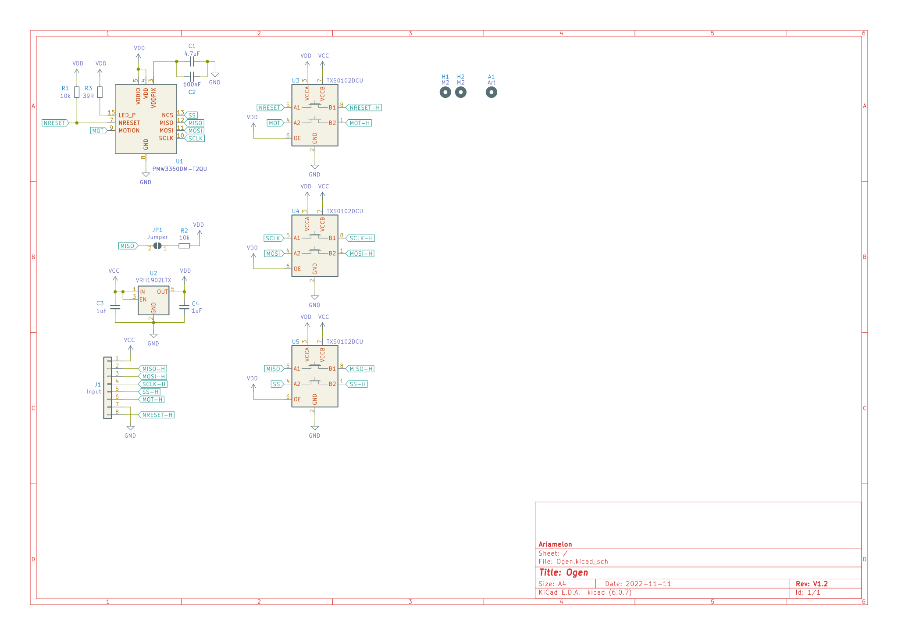

# Ogen
A PMW3360 breakout board based on [this](https://www.tindie.com/products/jkicklighter/pmw3360-motion-sensor/).

 ## Changelog
 * 11/11/2022: Initial update to V1.2. This board is now ready for JLCPCB SMT assembly service:
   - Replace linear voltage regulator : from [TLV70019](https://jlcpcb.com/partdetail/TexasInstruments-TLV70019DDCR/C2862411) (out of stock) to [VRH1902LTX](https://jlcpcb.com/partdetail/Anasem-VRH1902LTX/C697975) (in stock)
   - Add metadata to each part to enable generation of BOM / POS using [this plugin](https://github.com/bennymeg/JLC-Plugin-for-KiCad)
 * 23/06/2022: Initial update to V1.1. Changed the 5 1-bit shift registers to 3 2-bit ones. Slightly shrunk board. New logo (very important).
 * 04/10/2020: Fixed major flaw in PMW3360 footprint.
 * 30/09/2020: Initial commit.
